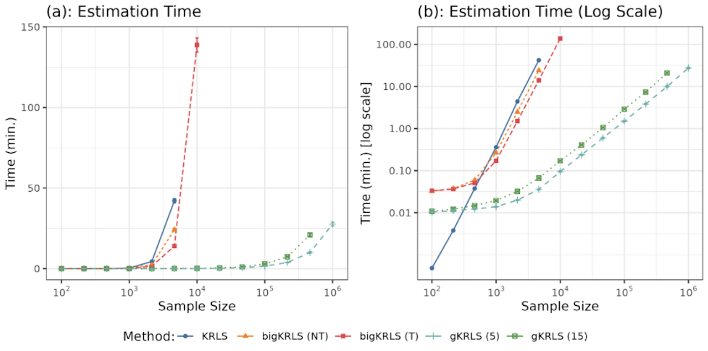
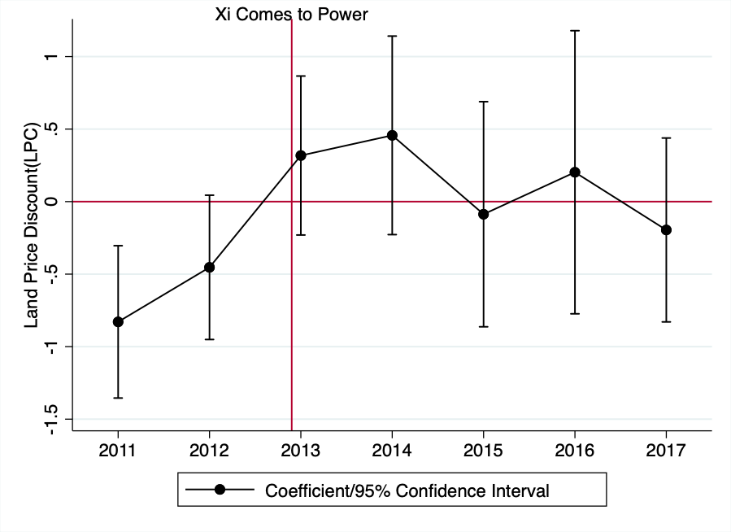
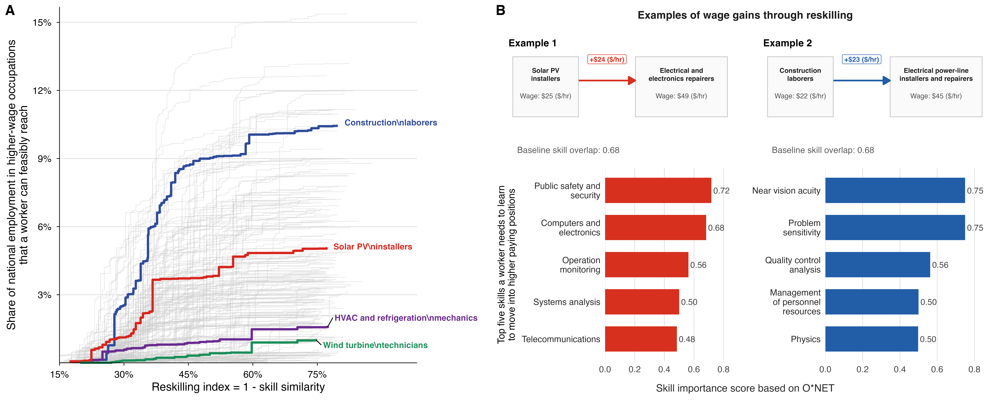
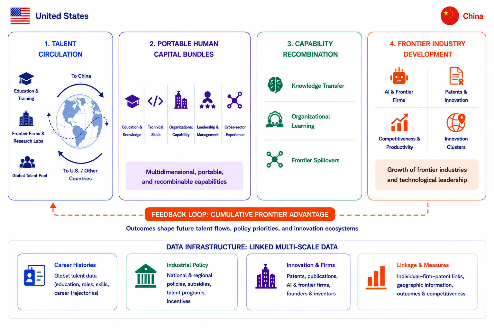
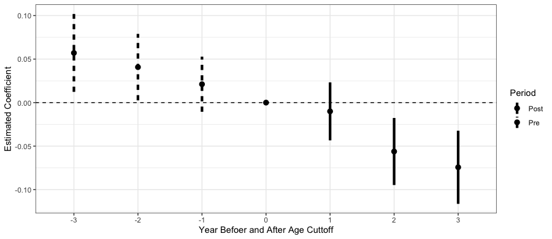

::: {.listing-page}
## Published articles

::: {.paper-list}
::: {.paper-entry}
::: {.paper-copy}
### Generalized Kernel Regularized Least Squares

<strong class="author-me">Chang, Qing</strong>, and Max Goplerud. <em>Political Analysis</em> 32.2 (2024): 157-171.

::: {.paper-links}
[Paper page](articles/published/gKRLS/) [Published Version](https://www.cambridge.org/core/journals/political-analysis/article/generalized-kernel-regularized-least-squares/09F9B1E299E26A452FCF256129F450E7) [Package on CRAN](https://cran.r-project.org/web/packages/gKRLS/index.html) [Arxiv](https://arxiv.org/abs/2209.14355)
:::
:::

::: {.paper-figure}
<button class="paper-figure-button" type="button" data-lightbox-src="articles/published/gKRLS/featured.png" data-lightbox-alt="gKRLS article figure" aria-label="Expand figure for Generalized Kernel Regularized Least Squares">
  
</button>
:::
:::

::: {.paper-entry}
::: {.paper-copy}
### Good Friends versus Best Friends: How Different Types of Political Connection Work in China

<strong class="author-me">Qing Chang</strong>. <em>Journal of Political Institutions and Political Economy</em> 4.2 (2023): 259-285.

::: {.paper-links}
[Paper page](articles/published/political_connection/) [Published Version](https://www.nowpublishers.com/article/Details/PIP-0078) [Code](https://dataverse.harvard.edu/dataset.xhtml?persistentId=doi:10.7910/DVN/UG0LGE) [Open Access](https://www.dropbox.com/scl/fi/sf236fcuov62j19f8648v/JPIPE_Final.pdf?rlkey=jtyerweq2mbdasjorggbuzvtk&e=1&dl=0)
:::
:::

::: {.paper-figure}
<button class="paper-figure-button" type="button" data-lightbox-src="articles/published/political_connection/featured.png" data-lightbox-alt="Political connection article figure" aria-label="Expand figure for Good Friends versus Best Friends">
  
</button>
:::
:::
:::

## Working papers

::: {.paper-list}
::: {.paper-entry}
::: {.paper-copy}
### Upward mobility in the green sector for frontline fossil fuel workers

<strong class="author-me">Qing Chang</strong>, Michael Aklin, Morgan R. Frank, Shanti Gamper-Rabindran. Under review at <em>Nature</em>.

Funded by Carnegie Corp of NY, grant no. G-22-59414.

::: {.paper-links}
[Paper page](articles/working/upward_mobility/) [Research story](projects/upward_mobility/)
:::
:::

::: {.paper-figure}
<button class="paper-figure-button" type="button" data-lightbox-src="articles/working/upward_mobility/featured.png" data-lightbox-alt="Upward mobility paper figure" aria-label="Expand figure for upward mobility in the green sector">
  
</button>
:::
:::

::: {.paper-entry}
::: {.paper-copy}
### US Green Federal Investments Created Quality Green Jobs and Benefitted Fossil Fuel Workers and Communities

<strong class="author-me">Qing Chang</strong>, Michael Aklin, Morgan R. Frank, Shanti Gamper-Rabindran.

Funded by Carnegie Corp of NY, grant no. G-22-59414.

:::

::: {.paper-figure}
<button class="paper-figure-button" type="button" data-lightbox-src="articles/working/us_green_federal_investments/featured.png" data-lightbox-alt="US green federal investments figure" aria-label="Expand figure for US Green Federal Investments Created Quality Green Jobs and Benefitted Fossil Fuel Workers and Communities">
  
</button>
:::
:::

::: {.paper-entry}
::: {.paper-copy}
### Promotion Incentives, Political Competition, and Public Land Prices

<strong class="author-me">Qing Chang</strong>.

Funded by Evelyn and Thomas Rawski Graduate Fellowship in China or Chinese Studies.

::: {.paper-links}
[Paper page](articles/working/develop_incentive/) [Research story](projects/develop_incentive/) [PDF](articles/working/develop_incentive/promotion_land.pdf)
:::
:::

::: {.paper-figure}
<button class="paper-figure-button" type="button" data-lightbox-src="articles/working/develop_incentive/featured.png" data-lightbox-alt="Promotion incentives paper figure" aria-label="Expand figure for Promotion Incentives, Political Competition, and Public Land Prices">
  
</button>
:::
:::

::: {.paper-entry}
::: {.paper-copy}
### Brains in Motion: U.S.-China Talent Flows in Strategic Technology Sectors

A. Javadian Sabet, <strong class="author-me">Qing Chang</strong>, Ziji Ma, Morgan Frank.

:::

::: {.paper-figure}
<button class="paper-figure-button" type="button" data-lightbox-src="articles/working/brains_in_motion/featured.png" data-lightbox-alt="Brains in Motion figure" aria-label="Expand figure for Brains in Motion: U.S.-China Talent Flows in Strategic Technology Sectors">
  
</button>
:::
:::

::: {.paper-entry}
::: {.paper-copy}
### Political Selection, Resource Allocation, and Long-term Economic Growth

<strong class="author-me">Qing Chang</strong>.

::: {.paper-links}
[Paper page](articles/working/geo_selection/) [PDF](articles/working/geo_selection/political_selection_growth.pdf)
:::
:::

::: {.paper-figure}
<button class="paper-figure-button" type="button" data-lightbox-src="articles/working/geo_selection/featured.png" data-lightbox-alt="Political selection paper figure" aria-label="Expand figure for Political Selection, Resource Allocation, and Long-term Economic Growth">
  
</button>
:::
:::

::: {.paper-entry}
::: {.paper-copy}
### Who Powers the Energy Transition? Engineering Talent in Clean Energy R&D

Arezou Farzaneh, <strong class="author-me">Qing Chang</strong>, Morgan R. Frank, Shanti Gamper-Rabindran.

Funded by The Mascaro Center for Sustainable Innovation.

:::

::: {.paper-figure .paper-figure-empty}
:::
:::

::: {.paper-entry}
::: {.paper-copy}
### Labor Gaps in the Green Transition: Challenges and Opportunities

Junghyun Lim, Michael Aklin, <strong class="author-me">Qing Chang</strong>, Florian Egli, Arezou Farzaneh, Morgan Frank, Shanti Gamper-Rabindran, Nathan Jensen, Valerie Karplus, David Konisky, Penny Mealy, Matto Mildenberger, Daniel Rock, Dustin Tingley, Anaelle Toure, Francesco Vona.

:::

::: {.paper-figure .paper-figure-empty}
:::
:::
:::
:::

