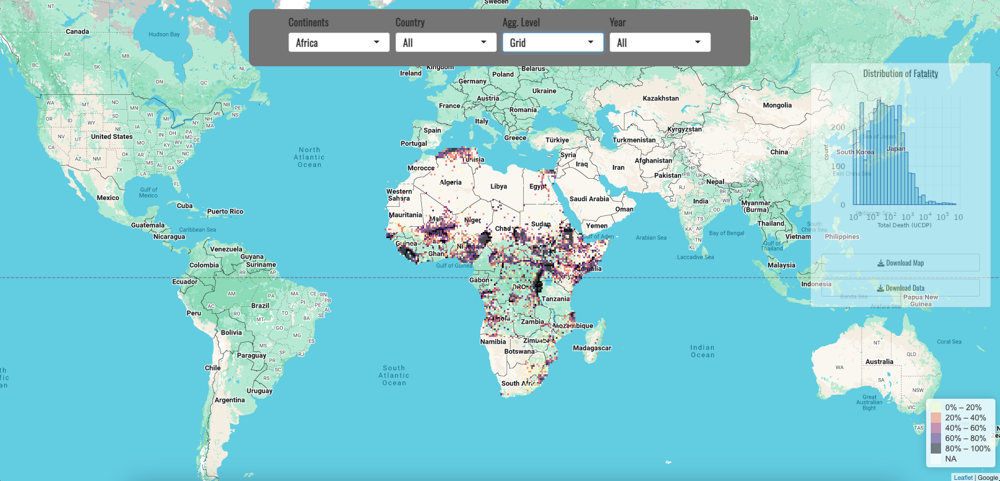
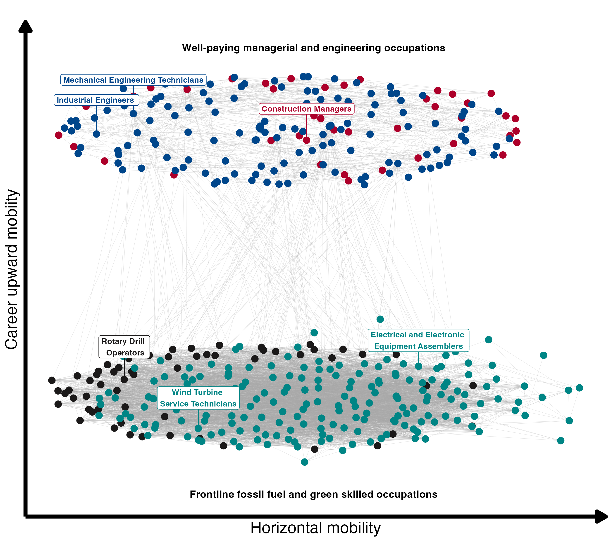
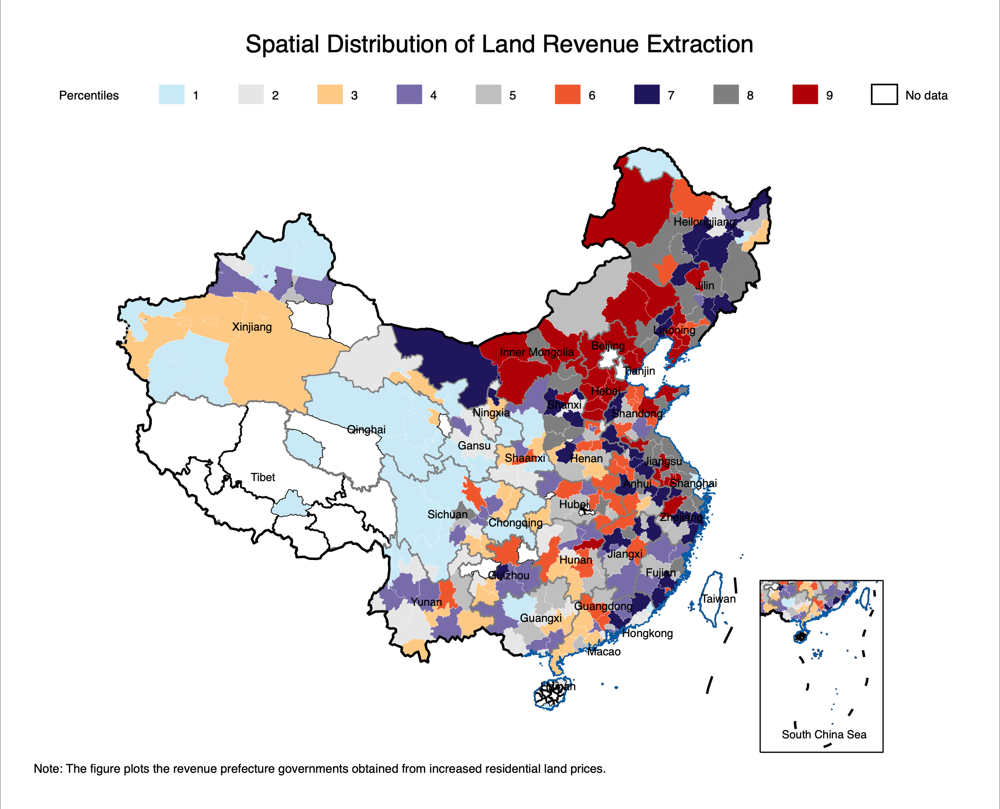

```{=html}
<section class="project-showcase" aria-label="Selected research project showcase">
  <article class="showcase-project">
    <a class="showcase-media" href="https://shiny.crc.pitt.edu/conflictscope/" target="_blank" rel="noopener noreferrer" aria-label="Open Conflict Prediction project in a new tab">
      
      <span class="showcase-scan" aria-hidden="true"></span>
    </a>
    <div class="showcase-copy">
      <div class="eyebrow">Interactive map</div>
      <h2>Conflict Prediction: an Interactive Map</h2>
      <p>Conflict forecasting work that turns spatial and relational structure into an explorable research interface.</p>
      <div class="showcase-steps" aria-label="Project workflow">
        <span>Actors</span>
        <span>Places</span>
        <span>Events</span>
        <span>Forecasts</span>
      </div>
      <a class="story-link" href="https://shiny.crc.pitt.edu/conflictscope/" target="_blank" rel="noopener noreferrer">View project</a>
    </div>
  </article>

  <article class="showcase-project">
    <a class="showcase-media" href="projects/upward_mobility/" aria-label="Open Upward Mobility project story">
      
      <span class="showcase-scan" aria-hidden="true"></span>
    </a>
    <div class="showcase-copy">
      <div class="eyebrow">Research Story</div>
      <h2>Upward Mobility of Frontline Fossil Fuel Workers</h2>
      <p>A visual story about how green-sector transitions can create career ladders, wage gains, and skill pathways for frontline fossil fuel workers.</p>
      <div class="showcase-steps" aria-label="Project workflow">
        <span>Workers</span>
        <span>Mobility</span>
        <span>Wages</span>
        <span>Skills</span>
      </div>
      <a class="story-link" href="projects/upward_mobility/">Read story</a>
    </div>
  </article>

  <article class="showcase-project">
    <a class="showcase-media" href="projects/develop_incentive/" aria-label="Open Promotion Incentives project story">
      
      <span class="showcase-scan" aria-hidden="true"></span>
    </a>
    <div class="showcase-copy">
      <div class="eyebrow">Research Story</div>
      <h2>Promotion Incentives, Political Competition, and Public Land Prices</h2>
      <p>A visual story about how career pressure can move land prices, reshape distributional conflict, and increase protest.</p>
      <div class="showcase-steps" aria-label="Project workflow">
        <span>Incentives</span>
        <span>Land</span>
        <span>Borders</span>
        <span>Protest</span>
      </div>
      <a class="story-link" href="projects/develop_incentive/">Read story</a>
    </div>
  </article>
</section>
```
